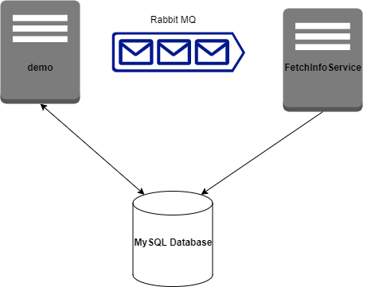

# personal-imdb
This is a Spring Boot application to build an IMDb clone-like site. It's a personal project to improve my technical skills while working on something I like to do in my spare time: watching movies.

## Tech Stack
 - Spring Boot
 - JWT
 - Java
 - Kotlin
 - RabbitMQ
 - MySQL

## Application Architecture

    

## Next major updates
 - Create a vue frontend
 - Aggregate logs and visualize metrics using ELK stack
 - Dockerize the DB, RabbitMQ and Spring app 
